<div align="center">

# 🚀 CachyLLama-BUILDER
### Automated Nightly Multi-Arch Builds & Turnkey Releases for AMD APUs, ROCm, Vulkan, and Discrete GPUs

[](https://github.com/Heretek-AI/CachyLLama-BUILDER/actions/workflows/build-cachyllama-rocm.yml)
[](https://github.com/Heretek-AI/CachyLLama-BUILDER/actions/workflows/build-cachyllama-all.yml)
[](https://github.com/Heretek-AI/CachyLLama-BUILDER/actions/workflows/build-llama-ai-bundle.yml)
[](LICENSE)
[](https://github.com/Heretek-AI/CachyLLama-BUILDER)
[](https://rocm.nightlies.amd.com/tarball-multi-arch/)
[](https://github.com/Heretek-AI/CachyLLama-BUILDER)

<p align="center">
  <b>Zero-dependency, portable, pre-compiled binaries and turnkey distribution packages for:</b><br/>
  <b><a href="https://github.com/fewtarius/CachyLLama">fewtarius/CachyLLama</a></b> (Persistent On-Disk KV Cache, MoE Expert Residency, Lightning Indexer)<br/>
  and <b><a href="https://github.com/fewtarius/llama-ai">fewtarius/llama-ai</a></b> (Optimistic-First Solver, Dynamic APU Tuning, Turnkey Runner).
</p>

</div>

---

## ⚡ Overview

**CachyLLama-BUILDER** delivers automated daily builds, multi-backend packaging, and release distribution for [fewtarius/CachyLLama](https://github.com/fewtarius/CachyLLama) and [fewtarius/llama-ai](https://github.com/fewtarius/llama-ai). Modeled after the dual architecture of [lemonade-sdk/llamacpp-rocm](https://github.com/lemonade-sdk/llamacpp-rocm) and [lemonade-sdk/llama.cpp](https://github.com/lemonade-sdk/llama.cpp), this repository produces 100% portable binaries requiring **zero host ROCm/CUDA installations**.

Whether you are running an **AMD Strix Halo APU (Radeon 8060S / 128 GB)**, **Strix Point (Radeon 890M)**, **Phoenix (Radeon 780M / 7940HS / 7840U)**, **Steam Deck (Van Gogh / 680M)**, or modern **RDNA3 / RDNA4 / NVIDIA / Apple Silicon** hardware, ready-to-run release packages are built every night.

```mermaid
flowchart LR
    subgraph Upstream ["Upstream Engines & Toolchains"]
        C["fewtarius/CachyLLama<br/>(C++ Inference Engine)"]
        L["fewtarius/llama-ai<br/>(Runner & Optimizing Solver)"]
        R["AMD TheRock<br/>(ROCm 7.x Multi-Arch Nightlies)"]
    end

    subgraph CI ["CachyLLama-BUILDER CI Matrix"]
        W1["ROCm Nightly Matrix<br/>(gfx1151, gfx1150, gfx120X, gfx110X, gfx103X, gfx90a/908)"]
        W2["Multi-Backend Matrix<br/>(Vulkan RADV, CPU x64/arm64, CUDA sm_75-121, Metal)"]
        W3["llama-ai Turnkey Packager<br/>(Pre-compiled + Solver + llama-run.sh)"]
    end

    subgraph Dist ["Portable Turnkey Releases"]
        D1["cachy-llama-bXXXX-ubuntu-rocm-gfx1151-x64.zip"]
        D2["cachy-llama-bXXXX-bin-ubuntu-vulkan-x64.tar.gz"]
        D3["llama-ai-bXXXX-linux-x64-bundle.tar.gz"]
    end

    Upstream --> CI --> Dist
```



---

## 🎯 Supported Hardware Matrix

All ROCm and Vulkan packages are pre-compiled and bundled with required dynamic libraries, memory allocators, and `$ORIGIN` RPATH for direct out-of-the-box execution:

| Architecture | GFX Target | Target AMD Devices & APUs / GPUs | Release Asset Pattern |
| :--- | :--- | :--- | :--- |
| **RDNA3.5 (Strix Halo)** | `gfx1151` | **Ryzen AI Max+ 395 / Radeon 8060S (128 GB)** (Nimo Axis N161, Framework 16) | `cachy-llama-${TAG}-${os}-rocm-gfx1151-x64.zip` |
| **RDNA3.5 (Strix Point)**| `gfx1150` | **Ryzen AI 9 HX 370 / 365 / Radeon 890M / 880M** (Asus Zenbook S16, G16) | `cachy-llama-${TAG}-${os}-rocm-gfx1150-x64.zip` |
| **RDNA4** | `gfx120X` | **Next-Gen RDNA4 Discrete GPUs** (`gfx1200`, `gfx1201`) | `cachy-llama-${TAG}-${os}-rocm-gfx120X-x64.zip` |
| **RDNA3** | `gfx110X` | **Radeon 780M / 760M** (7840U, 7940HS, Ayaneo Flip, GPD Win 4), **RX 7900 XTX / 7900 XT / 7800 XT** | `cachy-llama-${TAG}-${os}-rocm-gfx110X-x64.zip` |
| **RDNA2** | `gfx103X` | **Steam Deck / Van Gogh 0405, 680M** (6800U), **RX 6800 / 6700 / 6600** | `cachy-llama-${TAG}-${os}-rocm-gfx103X-x64.zip` |
| **CDNA / CDNA2** | `gfx90a`, `gfx908` | **AMD Instinct MI250X, MI210, MI100** Data Center Accelerators | `cachy-llama-${TAG}-${os}-rocm-gfx90a-x64.zip` |
| **Universal Vulkan** | `RADV` | **Universal Linux AMD APU Support** (Maximum driver stability without ROCm kernel DKMS) | `cachy-llama-${TAG}-bin-ubuntu-vulkan-x64.tar.gz` |
| **NVIDIA CUDA** | `sm_75` - `sm_121` | **RTX 20 / 30 / 40 / 50 Series, A100, H100, Blackwell** | `cachy-llama-${TAG}-bin-ubuntu-cuda-${sm}-x64.tar.gz` |
| **Apple Silicon** | `Metal` | **M1, M2, M3, M4 (Pro / Max / Ultra)** | `cachy-llama-${TAG}-bin-macos-metal-arm64.tar.gz` |

---

## 📦 Quick Start Guides

### 1. Ready-to-Run `llama-ai` Turnkey Bundle (Recommended for APUs)

The `llama-ai` bundle includes the full autonomous runner, the optimistic-first profile solver, systemd service units, and pre-compiled CachyLLama binaries.

```bash
# 1. Download and extract the bundle from GitHub Releases
tar -xzf llama-ai-b1001-linux-x64.tar.gz
cd llama-ai

# 2. Start the server (auto-detects hardware and calculates optimal GPU/KV budget)
./llama-run.sh --server

# 3. Or specify a model and backend explicitly
./llama-run.sh --server /path/to/model.gguf --backend vulkan
```

### 2. Standalone CachyLLama ROCm Inference

```bash
# Extract the target archive
unzip cachy-llama-b1001-ubuntu-rocm-gfx1151-x64.zip -d cachy-llama
cd cachy-llama

# Launch local CLI chat with full GPU offloading
./llama-cli -m /path/to/DeepSeek-V3-Q4_K_M.gguf -ngl 99 -p "Explain KV cache paging in CachyLLama"
```

### 3. Standalone CachyLLama Server (OpenAI-Compatible API)

```bash
./llama-server \
  -m /path/to/model.gguf \
  -ngl 99 \
  --port 8080 \
  --host 0.0.0.0 \
  --ctx-size 32768 \
  --ubatch 2048
```

---

## 🌟 Key Architecture & Portability Features

- **Zero Host ROCm Dependency**: Standalone Linux and Windows packages bundle all required ROCm runtime libraries (`rocblas.dll` / `.so`, `hipblaslt.dll` / `.so`, `amdhip64`, `libamd_comgr`, `origami`, `rocm_kpack`, etc.).
- **`$ORIGIN` RPATH Patchelfing**: Linux binaries are dynamically linked against their sibling libraries in the same directory using `patchelf --set-rpath '$ORIGIN'`, ensuring zero library collisions with system packages on SteamOS, Bazzite, CachyOS, Fedora, or Ubuntu.
- **AMD TheRock Multi-Arch Dynamic Scraping**: Automatically checks `https://rocm.nightlies.amd.com/tarball-multi-arch/` to compile against the newest daily AMD ROCm toolchain.
- **Windows Toolchain Compatibility**: Automatically applies MSVC 14.4x / `windows-2022` environment pinning to eliminate compiler collisions between Clang HIP and MSVC headers.
- **Sequential Versioning**: Automatically manages sequential release tags (`b1001`, `b1002`...) matching upstream llama.cpp patterns.

---

## 🛠️ GitHub Actions Workflows

| Workflow | Schedule | Description |
| :--- | :--- | :--- |
| **[`build-cachyllama-rocm.yml`](.github/workflows/build-cachyllama-rocm.yml)** | `0 13 * * *` (Daily) | Automated nightly ROCm multi-arch builder for Windows & Ubuntu across all gfx targets. |
| **[`build-cachyllama-all.yml`](.github/workflows/build-cachyllama-all.yml)** | `0 2 * * *` (Daily) | Multi-backend release matrix (Linux Vulkan RADV, CPU x64/arm64, CUDA sm_75-121, Metal). |
| **[`build-llama-ai-bundle.yml`](.github/workflows/build-llama-ai-bundle.yml)** | `0 4 * * *` (Daily) | Turnkey `llama-ai` distribution bundle assembler. |
| **[`test-cachyllama-rocm.yml`](.github/workflows/test-cachyllama-rocm.yml)** | Post-Build / Manual | Automated GPU offload and prompt execution smoke test harness. |

### Manual Dispatch Parameters

Workflows can be dispatched on-demand via the **Actions** tab with custom inputs:
- `operating_systems`: comma-separated (`windows,ubuntu`)
- `gfx_target`: AMD GPU architectures (`gfx1151,gfx1150,gfx120X,gfx110X,gfx103X,gfx90a,gfx908`)
- `rocm_version`: version string or `latest` (auto-detected from AMD TheRock)
- `cachyllama_version`: branch, tag, or commit hash in `fewtarius/CachyLLama`
- `create_release`: boolean (`true`/`false`)

---

## 💻 Developer & Local Build Scripts

Helper scripts are provided in the `scripts/` directory for developer testing:

```bash
# Build CachyLLama ROCm backend locally on Linux
./scripts/build_rocm_local.sh gfx1151

# Build CachyLLama Vulkan backend locally on Linux
./scripts/build_vulkan_local.sh

# Harvest dynamic ROCm libraries from local installation
python3 scripts/gather_required_rocm_libs.py --rocm-dir /opt/rocm --dest-dir ./build/bin --platform linux

# Dry-run release notes generation
python3 scripts/generate_release_notes.py --tag b1001 --cachyllama-commit da9a6da --rocm-version "7.14.0" --targets "gfx1151,gfx1150,gfx110X" --output release_notes.md
```

---

## 📖 Developer & Agent References

- **[AGENTS.md](AGENTS.md)**: Technical reference for AI agents, CI architecture, and release protocols.
- **[CLAUDE.md](CLAUDE.md)**: Anthropic Claude Code developer command reference.
- **[GEMINI.md](GEMINI.md)**: Google Gemini / Antigravity developer reference.

---

## 📄 License & Attribution

This builder automation repository is licensed under the [MIT License](LICENSE).

Upstream projects:
- **[fewtarius/CachyLLama](https://github.com/fewtarius/CachyLLama)** (GPL-3.0 / MIT)
- **[fewtarius/llama-ai](https://github.com/fewtarius/llama-ai)** (GPL-3.0 / CC-BY-NC-SA-4.0)
- **[ggml-org/llama.cpp](https://github.com/ggml-org/llama.cpp)** (MIT)
- **[lemonade-sdk/llamacpp-rocm](https://github.com/lemonade-sdk/llamacpp-rocm)** (MIT)
